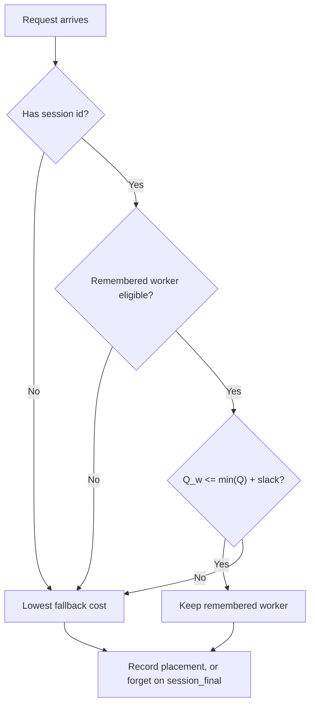

# Session affinity

`session-affinity-dynamo-policy` keeps each agent session on the worker that served its previous turn, as long as that worker is not overloaded. It is the worker-selection-policy port of the router prototype that was measured on SWE-bench with Pi agents (see [Results](#results)).

Agent turns re-send the whole conversation. The default KV router scores every turn independently, and a load tie or a small load edge on another worker is enough to move the session. Every move recomputes the full prefix on the new worker. This policy remembers the placement and moves a session only when its worker has fallen behind the fleet.

## Algorithm

For every already eligible worker `i`, the policy reads the following inputs:

| Symbol | Dynamo input | Meaning |
| --- | --- | --- |
| `R` | request blocks | Blocks in the request prefix |
| `B` | block size | Tokens per KV block |
| `Oᵢ` | device overlap blocks | Request blocks resident in worker `i`'s device KV cache |
| `Pᵢ` | active prefill tokens | In-flight prefill work on worker `i` |
| `Dᵢ` | decode cost blocks | In-flight decode work on worker `i` |
| `Qᵢ` | active requests | In-flight request count on worker `i` |
| `S` | session context | `session_id` and `session_final` from the request's agent context |

1. The scorer computes a cache-aware fallback cost in tokens: `Cᵢ = max(R - Oᵢ, 0) × B + Pᵢ + Dᵢ × B`.
2. The picker looks up the session's remembered worker `w`. Requests without a session id skip to step 4.
3. **Load gate.** If `w` is eligible and `Q_w ≤ min(Qᵢ) + slack_requests`, the picker returns `w`. Equality stays sticky.
4. Otherwise the picker returns the lowest `Cᵢ`, breaking exact ties by Dynamo's stable worker key.
5. The picker records the chosen worker for the session. When the request is marked `session_final`, it forgets the session instead.



The placement memory is an LRU map per routing partition, bounded by `max_sessions`. A session whose worker disappears falls back on its next turn and is re-recorded. The picker records at pick time, so if the host later rejects the pick, the next turn simply re-records.

## Configuration

The included [`worker-selection.yaml`](worker-selection.yaml) uses the values from the benchmark below.

| Parameter | Default | Meaning |
| --- | ---: | --- |
| `slack_requests` | `4` | The remembered worker is kept while it has at most this many more in-flight requests than the least-loaded eligible worker. `0` keeps a session only while its worker is least loaded. |
| `max_sessions` | `65536` | Sessions remembered per routing partition before LRU eviction. |

The crate registers the policy type `session-affinity`. Link it as Dynamo's `dynamo-worker-selection-policy-catalog` dependency, or call [`register`](src/lib.rs) from a combined catalog.

## Results

Measured with the same logic as a router hook before this port: SWE-bench Lite, 300 tasks, Harbor + Pi agents, Qwen3-32B-FP8 TP1 on 8x H100 (190K-token KV pool per worker), SGLang behind the Dynamo sidecar, 64 concurrent agents, 600 s warmup, 30 min steady window, Dynamo request traces plus 1 Hz engine metrics.

| Metric (c=64) | Default KV router | Session affinity, slack 4 |
| --- | ---: | ---: |
| Mean LLM time per turn | 6.22 s | 4.25 s |
| TTFT p50 / p99 | 258 ms / 8.1 s | 164 ms / 4.6 s |
| Recomputed prompt tokens (30 min) | 27.3M | 14.1M |
| Continuing turns that changed worker | 2,951 of 9,500 | 174 of 9,697 |
| Engine cached prompt fraction | 0.87 | 0.93 |

Without the load gate (pure stickiness) TTFT p99 rose to 14 s from load concentration. With the gate, p99 fell below baseline.

**Know the knee.** Affinity only helps while the live working set fits the KV pools. At 96 agents (about 2.0M live tokens against 1.52M pool) both routers thrashed and affinity reduced throughput by 22%, because evicted tokens equaled recomputed tokens either way. Above the knee, lower `slack_requests` or disable the policy. A gate that backs off when engine cache hit collapses is future work.

## Run with Dynamo Mockers

Build the Dynamo Python extension against the same Dynamo revision declared in this crate, replacing Dynamo's empty policy catalog with this package:

```bash
cargo add --manifest-path /path/to/dynamo/lib/bindings/python/Cargo.toml \
  --optional --rename dynamo-worker-selection-policy-catalog \
  --path /path/to/router-sandbox/crates/session-affinity \
  session-affinity-dynamo-policy

cd /path/to/dynamo/lib/bindings/python
CARGO_TARGET_DIR=/path/to/dynamo/target maturin develop --uv --features custom-policy
```

Start a KV-aware frontend and two Mockers with the included configuration. Requests must carry an agent session id (`agent_context.session_id`) for the affinity path to engage:

```bash
DYN_ROUTER_WORKER_SELECTION_POLICY=session-affinity \
python -m dynamo.frontend --router-mode kv \
  --router-policy-config /path/to/router-sandbox/crates/session-affinity/worker-selection.yaml \
  --discovery-backend file

python -m dynamo.mocker --model-path Qwen/Qwen3-0.6B \
  --discovery-backend file --num-workers 2
```

## Validation

```bash
cargo test -p session-affinity-dynamo-policy
cargo clippy -p session-affinity-dynamo-policy --all-targets -- -D warnings
```
