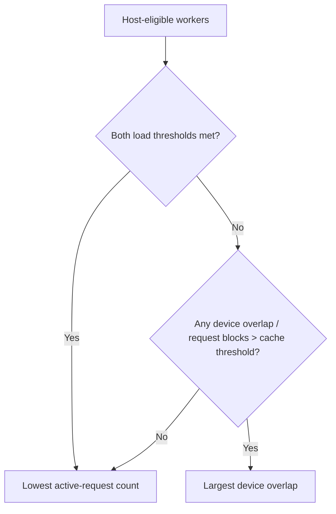

# SGLang cache-aware policy

`sglang-cache-aware-dynamo-policy` implements SGLang Model Gateway's cache-aware selection policy as a Dynamo worker-selection-policy catalog.

## Algorithm

For every already eligible worker `i`, the picker reads the following Dynamo signals:

| Symbol | Dynamo input | Meaning |
| --- | --- | --- |
| `R` | request blocks | Blocks in the incoming prompt |
| `Oᵢ` | device overlap blocks | Request blocks resident in worker `i`'s device KV cache |
| `Qᵢ` | active requests | Router-tracked in-flight request count |

1. Let `Qmin` and `Qmax` be the minimum and maximum `Qᵢ` across Dynamo host-eligible workers.
2. The pool is imbalanced only when both strict predicates hold: `Qmax - Qmin > balance_abs_threshold` and `Qmax > balance_rel_threshold × Qmin`.
3. When imbalanced, choose the least-loaded worker and ignore cache affinity.
4. Otherwise, a worker cache-qualifies when `R > 0` and `Oᵢ / R > cache_threshold`. Choose the qualifying worker with the largest device overlap.
5. If no worker cache-qualifies, choose the least-loaded worker.

Exact ties use Dynamo's stable worker/rank key. SGLang randomizes ties, but candidate row order is deliberately unspecified in Dynamo, so deterministic ties keep replicas consistent.



This is an intentional semantic upgrade over a byte-for-byte SGLang port: SGLang uses an approximate character-prefix history tree, while Dynamo reads authoritative device-KV overlap. It does not add Dynamo core APIs or maintain a duplicate prefix tree.

## Configuration

[`worker-selection.yaml`](worker-selection.yaml) configures the policy for aggregated, prefill, and decode pools.

| Parameter | Default | Meaning |
| --- | ---: | --- |
| `cache_threshold` | `0.3` | Strict device-cache fraction required for affinity |
| `balance_abs_threshold` | `64` | Strict active-request gap needed before cache bypass |
| `balance_rel_threshold` | `1.5` | Strict active-request ratio needed before cache bypass |

`active_requests` comes from Dynamo reservation lifecycle accounting. A deployment must preserve normal admission, completion, and cancellation events for the load gate to remain meaningful.

## Run with Dynamo Mockers

Build Dynamo against this catalog crate by replacing the empty catalog dependency in `/path/to/dynamo/lib/bindings/python/Cargo.toml`:

```toml
# dynamo-worker-selection-policy-catalog = { path = "../../router-plugins/catalog", optional = true }
dynamo-worker-selection-policy-catalog = { package = "sglang-cache-aware-dynamo-policy", path = "/path/to/router-sandbox/crates/sglang-cache-aware", optional = true }
```

```bash
cd /path/to/dynamo/lib/bindings/python
CARGO_TARGET_DIR=/path/to/dynamo/target maturin develop --uv --features custom-policy
```

Start the KV frontend and two Mockers with the same file-store namespace. `model_path` must be a local directory containing the model tokenizer (the mocker does not require model weights):

```bash
export DYN_FILE_KV="$(mktemp -d)"
export DYN_NAMESPACE=sglang-cache-aware-mocker
export MODEL_DIR=/path/to/Qwen2.5-0.5B-Instruct

python -m dynamo.frontend --router-mode kv \
  --router-policy-config /path/to/router-sandbox/crates/sglang-cache-aware/worker-selection.yaml \
  --model-path "$MODEL_DIR" --model-name Qwen/Qwen2.5-0.5B-Instruct \
  --discovery-backend file --request-plane tcp --event-plane zmq \
  --router-min-initial-workers 2

python -m dynamo.mocker --router-mode kv --model-path "$MODEL_DIR" \
  --model-name Qwen/Qwen2.5-0.5B-Instruct --discovery-backend file \
  --request-plane tcp --event-plane zmq --num-workers 2 --speedup-ratio 0
```

## Validation

```bash
cargo test -p sglang-cache-aware-dynamo-policy
cargo clippy -p sglang-cache-aware-dynamo-policy -- -D warnings
cargo fmt --check
```
