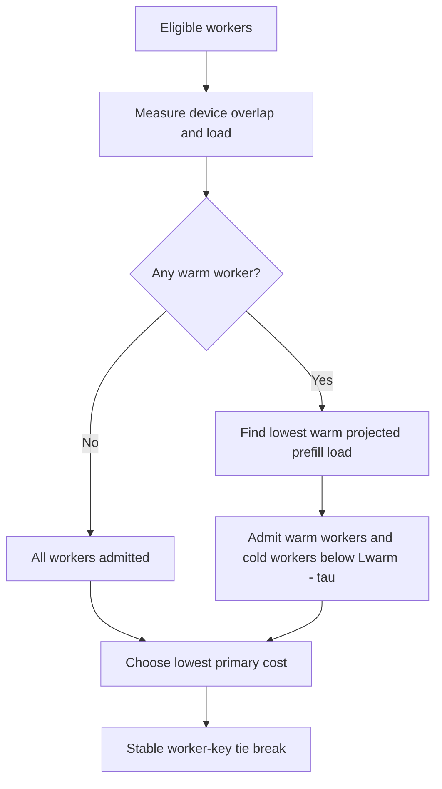

# Sticky until saturated

`sticky-until-saturated-dynamo-policy` implements llm-d's [sticky-until-saturated token-aware routing strategy](https://llm-d.ai/blog/sticky-until-saturated-token-aware-routing) as a Dynamo worker-selection-policy catalog.

It keeps requests on a worker that already has most of the prompt in device KV cache, until admitting a cache-cold worker is predicted to improve TTFT by more than the cache-miss cost.

## Algorithm

For every already eligible worker `i`, the policy reads the following inputs:

| Symbol | Dynamo input | Meaning |
| --- | --- | --- |
| `R` | request blocks | Blocks in the request prefix |
| `B` | block size | Tokens per KV block |
| `Oᵢ` | device overlap blocks | Request blocks resident in worker `i`'s device KV cache |
| `Pᵢ` | active prefill tokens | In-flight prefill work on worker `i` |
| `Qᵢ` | active requests | In-flight request count on worker `i` |

The picker makes two passes over the eligible workers:

1. A worker is **warm** when `R > 0` and `Oᵢ / R ≥ affinity_threshold`. The policy intentionally considers only device-resident KV blocks; host and disk cache tiers have different retrieval costs and are not folded into this binary test.
2. It computes the projected prefill load for each worker: `Lᵢ = Pᵢ + max(R - Oᵢ, 0) × B`.
3. It finds the lowest projected load among warm workers, `Lwarm`.
4. A cold worker is admitted only when `Lᵢ < Lwarm - τ`, where the saturation margin is `τ = peak_prefill_tokens_per_second × max_ttft_penalty_ms / 1000`. The comparison is strict: equality remains sticky.
5. From the admitted set, the policy chooses the lowest primary cost and breaks exact ties by Dynamo's stable worker key.



This is a global picker rather than a candidate-table filter. A cold worker must remain visible until the picker compares its projected prefill load with the best warm worker, so it can return when the warm set saturates.

### Pool-specific primary cost

| Worker type | Primary selection cost | Saturation guard |
| --- | --- | --- |
| `prefill`, `aggregated` | Projected prefill load `Lᵢ` | Projected prefill load `Lᵢ` |
| `decode`, `encode` | Active requests `Qᵢ` | Projected prefill load `Lᵢ` |

Prefill and aggregated pools fail closed when Dynamo is not tracking prefill tokens. Enable `--router-track-prefill-tokens` for those pools.

## Configuration

The included [`worker-selection.yaml`](worker-selection.yaml) uses the article-aligned defaults.

| Parameter | Default | Meaning |
| --- | ---: | --- |
| `affinity_threshold` | `0.8` | Device-cache fraction required for the warm set |
| `peak_prefill_tokens_per_second` | `15928.0` | Peak prefill throughput used to convert the TTFT budget to tokens |
| `max_ttft_penalty_ms` | `18000` | Maximum cache-miss TTFT penalty |

With the defaults, `τ = 286,704` tokens. Smaller values re-admit cold workers sooner; larger values preserve cache affinity for longer.

The crate registers the policy type `sticky-until-saturated`. Link it as Dynamo's `dynamo-worker-selection-policy-catalog` dependency, or call [`register`](src/lib.rs) from a combined catalog.

## Run with Dynamo Mockers

Build the Dynamo Python extension against the same Dynamo revision declared in this crate, replacing Dynamo's empty policy catalog with this package:

```bash
cargo add --manifest-path /path/to/dynamo/lib/bindings/python/Cargo.toml \
  --optional --rename dynamo-worker-selection-policy-catalog \
  --path /path/to/router-sandbox/crates/sticky-until-saturated \
  sticky-until-saturated-dynamo-policy

cd /path/to/dynamo/lib/bindings/python
CARGO_TARGET_DIR=/path/to/dynamo/target maturin develop --uv --features custom-policy
```

Start a KV-aware frontend and two Mockers with the included configuration:

```bash
DYN_ROUTER_WORKER_SELECTION_POLICY=sticky-until-saturated \
python -m dynamo.frontend --router-mode kv \
  --router-policy-config /path/to/router-sandbox/crates/sticky-until-saturated/worker-selection.yaml \
  --discovery-backend file

python -m dynamo.mocker --model-path Qwen/Qwen3-0.6B \
  --discovery-backend file --num-workers 2
```

## Validation

```bash
cargo test -p sticky-until-saturated-dynamo-policy
cargo clippy -p sticky-until-saturated-dynamo-policy --features bench --benches -- -D warnings
cargo bench -p sticky-until-saturated-dynamo-policy --features bench --bench sticky_until_saturated
```

The benchmark isolates the two-pass picker calculation over 10,000 synthetic, already eligible workers. It intentionally excludes discovery, candidate construction, transport, and host eligibility work.
