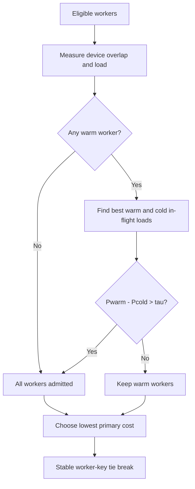

# Sticky until saturated

`sticky-until-saturated-dynamo-policy` implements llm-d's [sticky-until-saturated token-aware routing strategy](https://llm-d.ai/blog/sticky-until-saturated-token-aware-routing) as a Dynamo worker-selection-policy catalog.

It keeps requests on a worker that already has most of the prompt in device KV cache, until the best cache-cold worker's estimated TTFT is lower by more than the configured penalty. It then restores every worker to the candidate set and selects by projected token load.

## Algorithm

For every already eligible worker `i`, the policy reads the following inputs:

| Symbol | Dynamo input | Meaning |
| --- | --- | --- |
| `R` | request blocks | Blocks in the request prefix |
| `B` | block size | Tokens per KV block |
| `Oᵢ` | device overlap blocks | Request blocks resident in worker `i`'s device KV cache |
| `Pᵢ` | active prefill tokens | In-flight prefill work on worker `i` |
| `Qᵢ` | active requests | In-flight request count on worker `i` |

The picker makes two passes over the eligible workers:

1. A worker is **warm** when `R > 0` and `Oᵢ / R ≥ affinity_threshold`. The policy intentionally considers only device-resident KV blocks; host and disk cache tiers have different retrieval costs and are not folded into this binary test.
2. It computes the projected prefill load for each worker: `Lᵢ = Pᵢ + max(R - Oᵢ, 0) × B`.
3. It finds the least in-flight prefill load among warm workers, `Pwarm`, and among cold workers, `Pcold`.
4. It keeps only warm workers unless `Pwarm - Pcold > τ`, where `τ = peak_prefill_tokens_per_second × max_ttft_penalty_ms / 1000`. The comparison is strict: equality remains sticky. If the gate opens, it restores the complete eligible set before scoring, exactly as LLM-D's affinity filter does.
5. It selects the lowest primary cost from that set and breaks exact ties by Dynamo's stable worker key.



This is a global picker rather than a candidate-table filter. It retains every worker until it has evaluated the same whole-set saturation gate as LLM-D.

### Pool-specific primary cost

| Worker type | Primary selection cost | Saturation guard |
| --- | --- | --- |
| `prefill`, `aggregated` | Projected prefill load `Lᵢ` | Warm-cache filter gated by in-flight prefill load `Pᵢ` |
| `decode`, `encode` | Active requests `Qᵢ` | None; every worker is scored |

Prefill and aggregated pools fail closed when Dynamo is not tracking prefill tokens. Enable `--router-track-prefill-tokens` for those pools.

## Configuration

The included [`worker-selection.yaml`](worker-selection.yaml) uses the article-aligned defaults.

| Parameter | Default | Meaning |
| --- | ---: | --- |
| `affinity_threshold` | `0.8` | Device-cache fraction required for the warm set |
| `peak_prefill_tokens_per_second` | `15928.0` | LLM-D default proxy used to convert the TTFT budget to tokens; calibrate it for the deployed worker before benchmarking |
| `max_ttft_penalty_ms` | `18000` | Maximum cache-miss TTFT penalty; `0` always keeps the warm set |

With the LLM-D default proxy, `τ = 286,704` tokens. It is not a calibrated result for a particular model or worker. Smaller values open the full candidate set sooner; larger values preserve cache affinity for longer.

The policy maps LLM-D's per-endpoint prefix match to Dynamo's device-resident KV overlap and its in-flight token counter to Dynamo's active prefill tokens. LLM-D randomizes exact max-score ties; this policy deliberately uses Dynamo's stable worker-key tie break for reproducibility.

The crate registers the policy type `sticky-until-saturated`. Link it as Dynamo's `dynamo-worker-selection-policy-catalog` dependency, or call [`register`](src/lib.rs) from a combined catalog.

## Calibrate peak prefill throughput before a benchmark

`peak_prefill_tokens_per_second` is a per-worker preprofile input, not a model-name constant. Calibrate it before a policy benchmark; do not begin the routed workload with `15928.0` and call the result calibrated. Label a run that retains `15928.0` as **LLM-D default proxy**.

Use one idle aggregate SGLang worker directly, without a Dynamo frontend, sidecar, or router. The calibration worker must be identical to the benchmark workers: model snapshot, SGLang revision and container image, GPU type, tensor parallelism, KV-cache format, context limit, HiCache settings, memory fraction, and `max-running-requests`.

1. Start the worker and read its startup log. Set `CHUNK_SIZE` to the effective `chunked_prefill_size` shown there. Do not substitute LLM-D's `8192` default. `max_prefill_tokens` is a separate limit and is not the calibration size.
2. Verify a short, streamed native SGLang request directly to `/generate`. Prefer `input_ids`: send a short known-valid ID list, `stream: true`, and `sampling_params.max_new_tokens: 1`; record that the response is streamed. For example:

   ```json
   {"input_ids":[1,2,3,4],"sampling_params":{"max_new_tokens":1},"stream":true}
   ```

   If this format is unavailable, generate unique text and verify its token count with the exact model tokenizer.
3. Send cache-miss prompts of exactly `CHUNK_SIZE` tokens, serially. Request one streamed output token and measure TTFT from request dispatch to the first streamed byte or chunk. Run five warmups, then collect twenty measurements. Make every prompt unique at the first token so GPU KV and HiCache cannot share a radix prefix. Confirm the worker log reports zero cached prompt tokens for every calibration request.
4. Calculate `R_peak = CHUNK_SIZE / median(measured_TTFT_seconds)`. For a configured `max_ttft_penalty_ms`, calculate `tau = R_peak * max_ttft_penalty_ms / 1000`. Optionally repeat on the second equivalent worker; use the median of both rates only when they are close enough to treat them as one fleet.
5. Store a machine-readable calibration artifact beside the benchmark with: all twenty TTFTs, their median, `R_peak`, `tau`, effective chunk size, cache-miss log evidence, full worker command, image digest, model snapshot, SGLang SHA, Dynamo SHA, and the complete benchmark worker configuration.
6. Update only `peak_prefill_tokens_per_second` in the policy instance. Retain `affinity_threshold: 0.8` and `max_ttft_penalty_ms: 18000` unless the experiment intentionally changes those independent controls. Start Dynamo with `DYN_ROUTER_WORKER_SELECTION_POLICY=sticky-until-saturated` and `--router-policy-config <config>`. Before applying load, retain the deployed catalog source that calls `sticky_until_saturated::register(...)` and the frontend log showing that environment override, policy config path, and successful model readiness. This Dynamo revision does not emit a separate named-policy startup line.
7. Run the unchanged routed workload only after step 6 passes. For the MiniMax AgentX comparison, that means two TP4 workers, C8, 900 seconds, the same seed and DYN request trace, plus Tachometer at 1 Hz. Record the calibrated `R_peak` and `tau` beside its latency and throughput results.

For example, an 8,192-token direct calibration with median TTFT `1.750314` seconds yields `R_peak = 4680.30` tokens/s. With the 18,000 ms penalty, `tau = 84,245.45` tokens. These are example values from one MiniMax TP4 FP8 worker configuration, not defaults for another deployment.

## Run with Dynamo Mockers

Build the Dynamo Python extension against the same Dynamo revision declared in this crate, replacing Dynamo's empty policy catalog with this package:

```bash
cargo add --manifest-path /path/to/dynamo/lib/bindings/python/Cargo.toml \
  --optional --rename dynamo-worker-selection-policy-catalog \
  --path /path/to/router-sandbox/crates/sticky-until-saturated \
  sticky-until-saturated-dynamo-policy

cd /path/to/dynamo/lib/bindings/python
CARGO_TARGET_DIR=/path/to/dynamo/target maturin develop --uv --features custom-policy
```

Start a KV-aware frontend and two Mockers with the included configuration:

```bash
DYN_ROUTER_WORKER_SELECTION_POLICY=sticky-until-saturated \
python -m dynamo.frontend --router-mode kv \
  --router-policy-config /path/to/router-sandbox/crates/sticky-until-saturated/worker-selection.yaml \
  --discovery-backend file

python -m dynamo.mocker --model-path Qwen/Qwen3-0.6B \
  --discovery-backend file --num-workers 2
```

## Validation

```bash
cargo test -p sticky-until-saturated-dynamo-policy
cargo clippy -p sticky-until-saturated-dynamo-policy --features bench --benches -- -D warnings
cargo bench -p sticky-until-saturated-dynamo-policy --features bench --bench sticky_until_saturated
```

The benchmark isolates the two-pass picker calculation over 10,000 synthetic, already eligible workers. It intentionally excludes discovery, candidate construction, transport, and host eligibility work.
