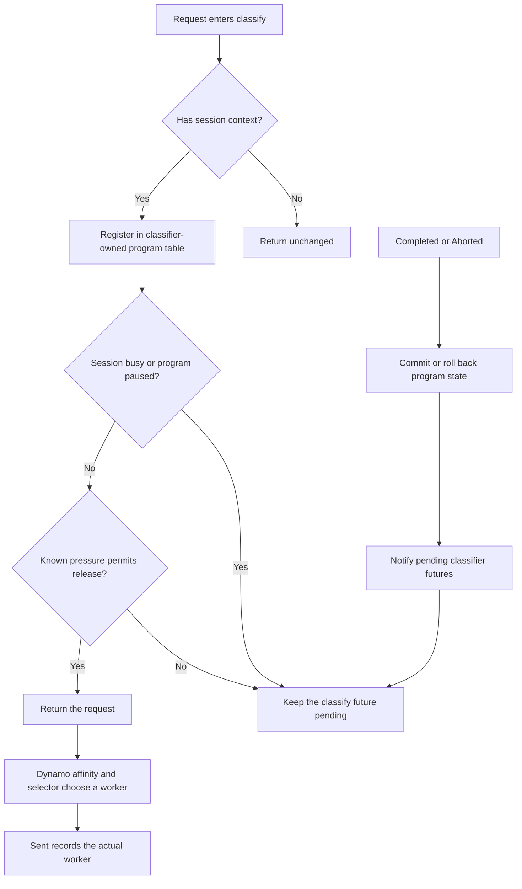

# ThunderAgent

`thunderagent-dynamo-policy` implements ThunderAgent's program-aware flow control on Dynamo's asynchronous request-classifier API. It registers through Dynamo's statically linked router-plugin catalog; no Python adapter or separate worker-selection policy is required.

This prototype is stacked on [ai-dynamo/dynamo#14123](https://github.com/ai-dynamo/dynamo/pull/14123) and its request-classifier catalog follow-up.

## Ownership and routing

`ThunderAgentClassifier` owns the complete program table: per-session serialization, reasoning/acting state, pause state, retained token usage, and the worker observed for each session. The state is internally reference-counted because `classify` must return independently pollable `'static` futures, but it is not shared with Dynamo's worker selector.

Dynamo's built-in hard or soft session affinity remains the placement authority. ThunderAgent does not choose a worker. The `Sent` lifecycle event records the worker that Dynamo actually selected, and subsequent capacity decisions use that observed assignment. If a worker disappears, ThunderAgent clears its observation and lets affinity select a valid replacement.

Requests without Dynamo session context return from classification immediately.



The catalog factory receives a cached view of Dynamo's existing discovery state. It derives each worker/rank's program-retention budget as `kv_cache_block_size * total_kv_blocks`, while representing worker liveness separately from missing capacity metadata. The callback only reads the cached view; it performs no discovery, model-card parsing, or blocking I/O on the classification path.

ThunderAgent computes live used capacity from its own program table. On each reconciliation, it accounts for active program tokens plus `buffer_per_program`. Acting programs use `acting_token_weight`. When a worker exceeds `pause_threshold`, the classifier pauses smaller acting programs first until usage reaches `pause_target`; in-flight reasoning programs are marked to pause after completion. A paused session keeps its observed affinity worker and resumes only when that worker falls below `pause_threshold - resume_hysteresis`. A pending request is force-released after `resume_timeout_seconds` to avoid permanent starvation.

The classifier cannot reserve the worker for a session's first request because classification intentionally precedes placement. It admits that request against the available pool, then uses `Sent` as the source of truth. Existing sessions have exact per-worker accounting because Dynamo affinity preserves their observed placement.

Completion records Dynamo's terminal input-plus-output context size. The current classifier lifecycle does not expose cumulative streaming context progress, so this crate updates program size only at completion. A final session removes its program when the final request is admitted; completion or abort cannot restore it. A continuing idle program retains its observed assignment for `session_retention_seconds`. Idle retention is pruned lazily on the next classification or periodic reconciliation. The tracking limit also bounds retained programs; at the limit, the oldest idle retained program is evicted before admitting a new session.

## Configuration

Link this crate in place of Dynamo's default router-plugin catalog, enable Dynamo session affinity, and select ThunderAgent in the router policy YAML:

```yaml
request_classifier:
  type: thunderagent
  parameters:
    pause_threshold: 0.95
    pause_target: 0.80
    resume_hysteresis: 0.10
    resume_timeout_seconds: 1800
    session_retention_seconds: 1800
    scheduler_interval_seconds: 5
    acting_token_weight: 1
    buffer_per_program: 100
    max_tracked_requests: 10000
```

| Parameter | Default | Meaning |
| --- | ---: | --- |
| `pause_threshold` | `0.95` | Worker usage fraction that begins pausing programs |
| `pause_target` | `0.80` | Worker usage fraction that a pause cycle drains toward |
| `resume_hysteresis` | `0.10` | Headroom below the pause threshold required for normal resume |
| `resume_timeout_seconds` | `1800` | Maximum classifier deferral before forced release |
| `session_retention_seconds` | `1800` | Idle continuing-program retention period |
| `scheduler_interval_seconds` | `5` | Fixed cadence for pressure and resume decisions while programs are tracked |
| `acting_token_weight` | `1` | Capacity weight for a program during tool work |
| `buffer_per_program` | `100` | Fixed token headroom per active program |
| `max_tracked_requests` | `10000` | Independent bounds for active request state and retained program state before classification reaches Dynamo's queue |
