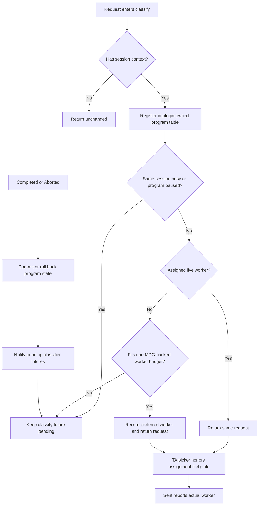

# ThunderAgent

`thunderagent-dynamo-policy` implements ThunderAgent's program-aware flow control on Dynamo's asynchronous request-classifier API. The crate owns the program table and keeps a classifier future pending while its program is paused. Dynamo continues to own request storage, queue ordering, overload rejection, worker eligibility, and dispatch.

This prototype is stacked on [ai-dynamo/dynamo#14123](https://github.com/ai-dynamo/dynamo/pull/14123).

## Algorithm

`ThunderAgentComponents` constructs two router components that share one private session-assignment map:

1. `ThunderAgentClassifier` serializes each session, owns reasoning/acting and active/paused program state, and releases a request only when its program may run.
2. The ThunderAgent worker-selection policy honors the classifier's `session_id -> worker/rank` assignment when that worker remains eligible. Otherwise it falls back to Dynamo load scoring, and the `Sent` lifecycle event reconciles the actual worker.

Requests without Dynamo session context return from classification immediately and use the fallback worker-selection behavior.

For the ordinary homogeneous ThunderAgent worker pool, the shared assignment map keeps capacity admission and worker selection consistent. Request-specific pins, filters, or other host eligibility constraints are a known boundary: if they exclude the classifier's assigned worker, the picker falls back and `Sent` corrects the program table only after dispatch. Exact per-worker capacity accounting for those constrained requests requires Dynamo to expose request eligibility before classification; this crate does not claim that case as faithful ThunderAgent behavior.



The capacity provider combines two cached host views:

- Model deployment cards provide each worker/rank's total program-retention budget. The usual device budget is `kv_cache_block_size * total_kv_blocks`; a host may add published native-offload capacity.
- Discovery provides the authoritative live-worker set. A live worker may temporarily have no model card, so missing capacity and worker removal are represented separately.

ThunderAgent computes live used capacity from its own program table. This crate does not subscribe to MDC or discovery itself; the Dynamo host must maintain the snapshot from its existing watchers. The provider callback must only clone and return a cached `Arc<WorkerCapacitySnapshot>`; it must not perform discovery, parse model cards, or block on the classification path. A new program flows through during MDC cold start, while a program already paused under known pressure remains paused until capacity returns or its resume timeout expires.

On each reconciliation, the classifier accounts for active program tokens plus `buffer_per_program`. Acting programs use a configurable token weight and a decayed estimate for forced timeout resumption. When a worker exceeds `pause_threshold`, the classifier pauses smaller acting programs first until usage reaches `pause_target`; in-flight reasoning programs are marked to pause after completion. Paused programs resume greedily below `pause_threshold - resume_hysteresis`. A pending request is force-released after `resume_timeout_seconds` to avoid permanent starvation.

Completion records Dynamo's terminal input-plus-output context size. The current classifier lifecycle does not expose the cumulative streaming context progress used by the final July ThunderAgent implementation, so this crate updates program size only at completion. A final session removes its program when the final request is admitted; completion or abort cannot restore it. A continuing idle program retains its assignment for `session_retention_seconds`. Idle retention is pruned lazily on the next classification or periodic reconciliation. The tracking limit also bounds retained programs; at the limit, the oldest idle retained program is evicted before admitting a new session.

## Construct the components

```rust
use std::sync::Arc;

use dynamo_kv_router::KvRouterConfig;
use parking_lot::RwLock;
use thunderagent_dynamo_policy::{
    ThunderAgentComponents, ThunderAgentConfig, WorkerCapacityProvider,
    WorkerCapacitySnapshot,
};

// The host's existing MDC/discovery watcher replaces this cached Arc when its
// model-card or live-worker view changes.
let current_capacity = Arc::new(RwLock::new(Arc::new(
    WorkerCapacitySnapshot::default(),
)));
let capacity_provider: Arc<dyn WorkerCapacityProvider> = {
    let current_capacity = Arc::clone(&current_capacity);
    Arc::new(move || current_capacity.read().clone())
};
let components = ThunderAgentComponents::new(
    KvRouterConfig::default(),
    "generate",
    ThunderAgentConfig::default(),
    capacity_provider,
)?;

let classifier = components.classifier;
let worker_selection_policy = components.worker_selection_policy;
```

Install `classifier` through Dynamo's `KvRouter::with_request_classifier` seam and supply `worker_selection_policy` through the existing worker-selection construction path. They are moved into separate router components but must come from the same `ThunderAgentComponents` value so their assignment state agrees.

## Configuration

| Parameter | Default | Meaning |
| --- | ---: | --- |
| `pause_threshold` | `0.95` | Worker usage fraction that begins pausing programs |
| `pause_target` | `0.80` | Worker usage fraction that a pause cycle drains toward |
| `resume_hysteresis` | `0.10` | Headroom below the pause threshold required for normal resume |
| `resume_timeout_seconds` | `1800` | Maximum classifier deferral before forced release |
| `session_retention_seconds` | `1800` | Idle continuing-program retention period |
| `scheduler_interval_seconds` | `5` | Fixed cadence for pressure and resume decisions while programs are tracked |
| `acting_token_weight` | `1` | Capacity weight for a program during tool work |
| `acting_decay_tau_seconds` | `1` | Half-life control for forced-resume placement |
| `buffer_per_program` | `100` | Fixed token headroom per active program |
| `max_tracked_requests` | `10000` | Independent bounds for active request state and retained program state before classification reaches Dynamo's queue |
