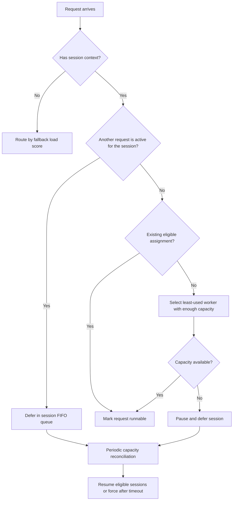

# ThunderAgent

`thunderagent-dynamo-policy` is a session-aware Dynamo routing policy. It owns the ThunderAgent admission and capacity state outside Dynamo while Dynamo continues to own request storage and serially invokes the policy from its queue actor.

Runnable ordering remains Dynamo-owned. This prototype depends on the Dynamo queue-admission seam in [ai-dynamo/dynamo#13019](https://github.com/ai-dynamo/dynamo/pull/13019).

## Algorithm

The returned `WorkerSelectionPolicy` combines three components:

1. The queue-admission policy serializes each session: a session has at most one runnable request, and subsequent requests wait in session order.
2. For a session without an existing assignment, admission selects an eligible available worker with enough reported token capacity. It chooses the least-used worker that can fit the request context plus `buffer_per_program`.
3. The picker preserves that session's assigned worker when it remains eligible; otherwise it falls back to the minimum Dynamo load score, breaking ties by stable worker key.

Requests without Dynamo session context bypass the session admission logic and use the fallback scorer and picker directly.



On each reconciliation interval, the policy accounts for active program tokens plus the configured per-program buffer. Acting programs use a configurable token weight and a decayed estimate for forced timeout resumption. When a worker exceeds `pause_threshold`, the policy pauses smaller acting programs first until usage reaches `pause_target`; reasoning programs are marked to pause after their current request completes. It resumes paused sessions greedily below `pause_threshold - resume_hysteresis`, preserving an existing assignment when possible. A paused session is force-resumed after `resume_timeout_seconds` when an eligible worker is available.

Completed sessions transition to an acting state and retain their assignment for `session_retention_seconds`; inactive retained sessions are later expired. Worker removal clears affected assignments.

## Configuration

The policy registers the type `thunderagent`. Its YAML parameters are the fields of `ThunderAgentConfig`; [`worker-selection.yaml`](worker-selection.yaml) supplies the defaults.

| Parameter | Default | Meaning |
| --- | ---: | --- |
| `pause_threshold` | `0.95` | Usage fraction that begins pausing programs |
| `pause_target` | `0.80` | Usage fraction to recover to after pausing |
| `resume_hysteresis` | `0.10` | Additional headroom required before greedy resume |
| `resume_timeout_seconds` | `1800` | Maximum deferred duration before forced resume |
| `session_retention_seconds` | `1800` | Retention period for completed acting sessions |
| `scheduler_interval_seconds` | `5` | Capacity reconciliation cadence |
| `acting_token_weight` | `1` | Normal capacity weight for an acting program |
| `acting_decay_tau_seconds` | `1` | Half-life control for the decayed acting estimate |
| `buffer_per_program` | `100` | Reserved tokens per active program |

## Integrate as a policy catalog

Link the crate directly as Dynamo's `dynamo-worker-selection-policy-catalog` dependency, or call [`register`](src/lib.rs) from a combined catalog. The policy factory can also be constructed programmatically:

```rust
use std::sync::Arc;

use dynamo_kv_router::WorkerSelectionPolicyFactory;
use thunderagent_dynamo_policy::{ThunderAgentConfig, worker_selection_policy};

let config = ThunderAgentConfig::default();
let factory: WorkerSelectionPolicyFactory = Arc::new(move |router, worker_type, _partition| {
    worker_selection_policy(router.clone(), worker_type, config.clone())
        .expect("valid ThunderAgent configuration")
});
```
